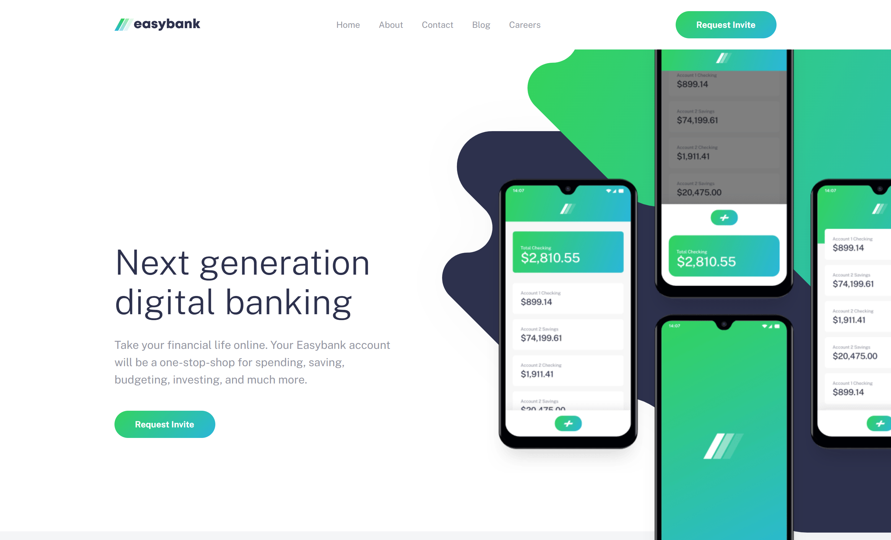
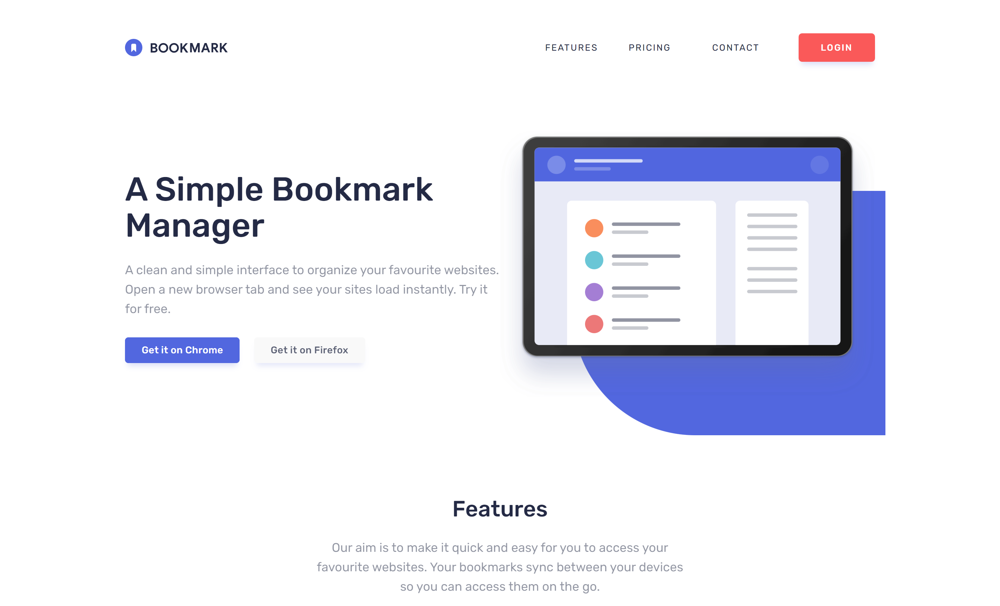
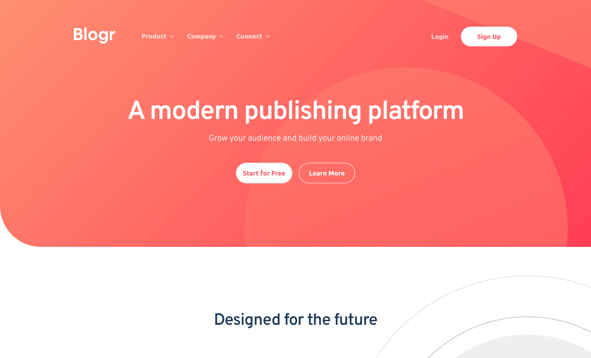
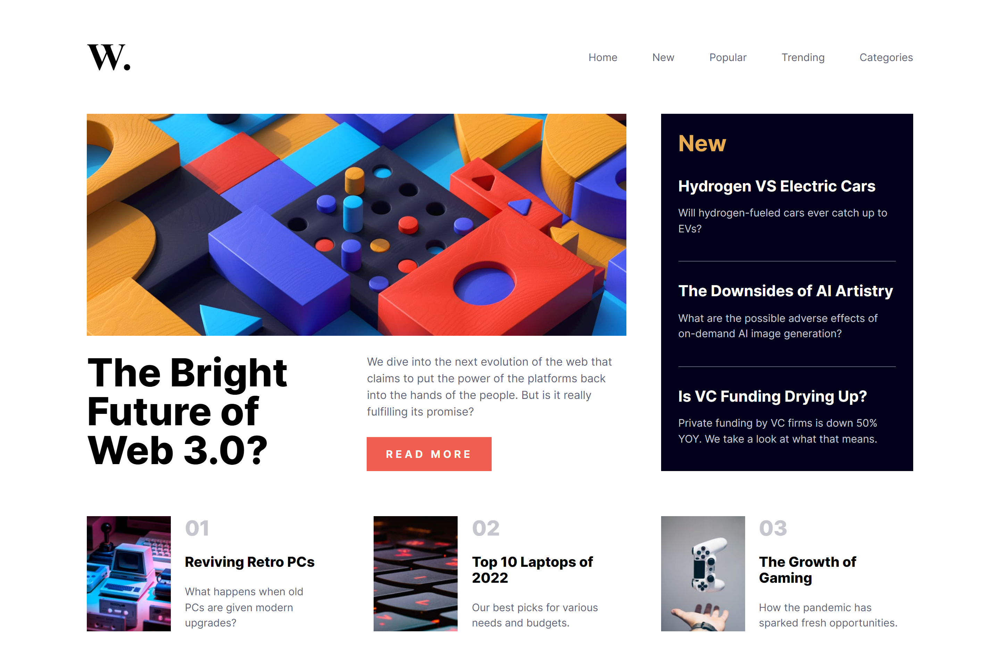
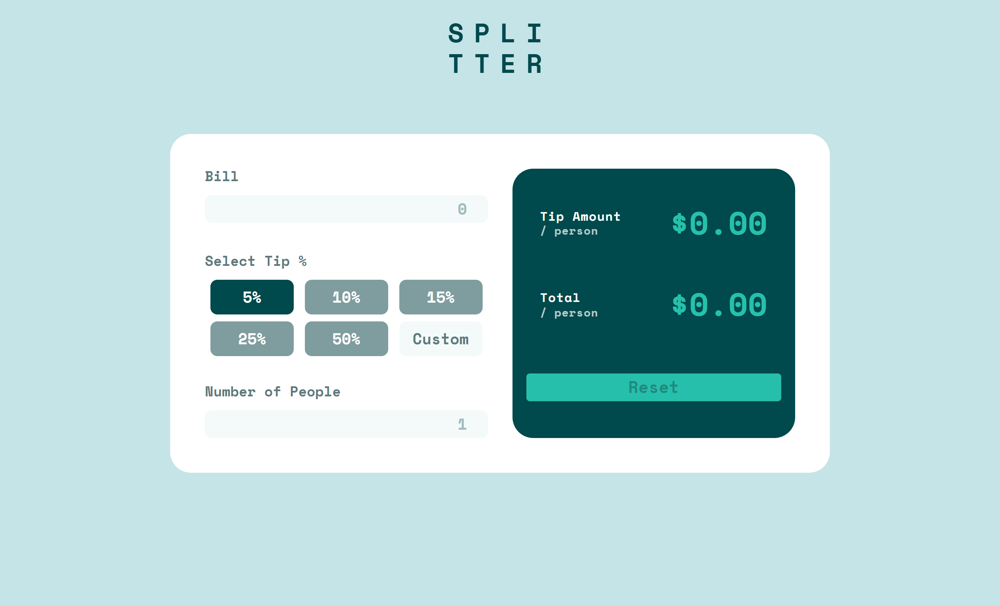
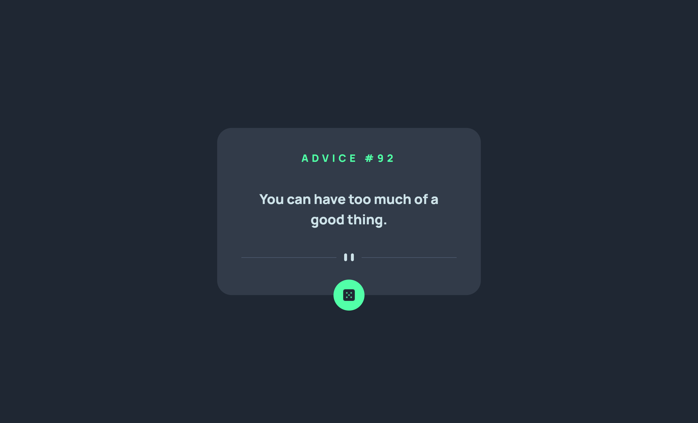

<h2>About this repo</h2>

Here I have some of mine study projects. That I made while learning HTML and CSS.

 

<h2>Screenshots of the Projects</h2>

 
<h3 align='center'>EasyBank landing page</h3>

 
<h3 align='center'>Bookmark landing page</h3>

 
<h3 align='center'>Crowdfund product page</h3>

 
<h3 align='center'>Blogr landing page</h3>

 
<h3 align='center'>News product page</h3>

 
<h3 align='center'>Tip calculator app</h3>

 
<h3 align='center'>Advice generator app</h3>

